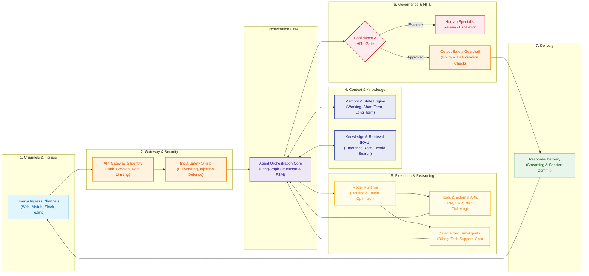

# Enterprise AI Customer Support Agent__

[](#system-architecture)
[](#key-architectural-decisions)
[-purple.svg)](#key-architectural-decisions)
[](LICENSE)

An enterprise-grade, high-reliability architecture and low-level engineering specification for an autonomous **Enterprise AI Customer Support Agent**. Built to handle mission-critical customer workflows, multi-day ticket lifecycles, regulatory compliance, context budget optimization, and human-in-the-loop (HITL) escalations.

---

## 📑 Documentation Index

| Document | Description |
| :--- | :--- |
| 📘 [**Master Architectural Report**](<./Enterprise AI Customer Support Agent Architecture - Formatted Master Report.md>) | Comprehensive 16-pillar architectural blueprint and literature review |
| 🏛️ [**System Architecture (HLD)**](./architecture.md) | Abstract 7-stage pipeline, end-to-end data flow, and foundational platform |
| ⚙️ [**Low-Level Design (LLD)**](./low_level_design.md) | Component contracts, Pydantic schemas, state reducers, and interfaces |
| 🧠 [**Component 5: Orchestration Deep Dive**](./component_5_orchestration_deep_dive.md) | Cognitive control plane, hybrid statecharts, context budgets, and resilience |
| 🛡️ [**Architectural Decisions (ADP Checkpoint)**](./checkpoint.md) | Confirmed ADRs (ADP-01 to ADP-04) and pre-execution Genesis blueprint |
| ⚠️ [**Failure Modes & Unknowns Matrix**](./failure_modes_matrix.md) | 2×2 Epistemic Matrix (Known/Unknown) mapping failure traps and recovery protocols |
| 🔄 [**Request-Response Lifecycle Walkthrough**](./request_response_lifecycle_example.md) | Detailed trace of a real-world enterprise request through all 14 components |
| 📊 [**Behavioral Evaluation Framework**](./user_evaluation_framework.md) | User-centric behavioral archetypes, evaluation metrics, and safety benchmarks |
| 🎨 [**Interactive Canvas (`architecture.tldr`)**](./architecture.tldr) | Multi-page visual system schematic and LLD statechart canvas |

---

## 🏛️ System Architecture



---

## 🔑 Key Architectural Decisions (ADPs)

| ID | Component | Title | Selected Architecture |
| :--- | :--- | :--- | :--- |
| **ADP-01** | Agent Runtime | Planning Paradigm | **Hybrid Dual-Process Statechart** (Deterministic LangGraph FSM for compliance/SOPs + scoped ReAct in edge nodes) |
| **ADP-02** | Agent Runtime | Workflow Durability | **Two-Tier Hybrid** (Temporal.io outer saga for multi-day durability & HITL + LangGraph inner cognitive loop) |
| **ADP-03** | Agent Runtime | Context Engineering | **Tripartite Structured Slot Allocator** (System 15%, Profile 15%, RAG 35%, Chat 25%, Scratchpad 10%) |
| **ADP-04** | Agent Runtime | Error Recovery | **Dual-Process Circuit Breaker** (Max 2 Reflexion trials, immediate HITL tripwire on persistence) |
| **ADP-05** | Agent Runtime | Decision Model | **Jev (TypeSafe) at decision points** (triage, FSM transition guards, tool selection; LangGraph stays the runner, code owns control flow) |

---

## 🎨 Interactive Whiteboard Canvas

The repository includes an interactive [tldraw](https://www.tldraw.com) canvas [`architecture.tldr`](./architecture.tldr):
* **Page 1: System Architecture & Failure Modes:** High-level end-to-end data flow and 2×2 Knowns/Unknowns failure mode cards.
* **Page 2: LLD - Agent Orchestration Core:** Low-level LangGraph statechart nodes, transitions, slot allocation diagrams, and circuit breaker tripwires.

### How to View the Canvas
1. **In VS Code:** Install the [tldraw extension](https://marketplace.visualstudio.com/items?itemName=tldraw-org.tldraw-vscode) and open [`architecture.tldr`](./architecture.tldr) directly.
2. **In Browser:** Open [tldraw.com](https://www.tldraw.com), click `Menu (☰)` → `File` → `Open` and select `architecture.tldr`.
3. **Regenerate / Customize:** Run the canvas generation scripts:
   ```bash
   python generate_architecture_tldr.py
   python generate_lld_page.py
   ```

---

## 📂 Pre-Execution Genesis Codebase Blueprint

When initialized for automated code generation, the system maps to the following directory structure:

```
src/
├── core/
│   ├── orchestrator/
│   │   ├── statechart.py        # LangGraph StateGraph, Node reducers, FSM edges
│   │   ├── triage.py            # Acuity & Intent routing (Jev Choice/Score/Noul)
│   │   ├── decisions.py         # Jev question sets: triage, transition guards, tool selection
│   │   └── planner.py           # Layer 2 Deliberative ReAct engine
│   ├── context/
│   │   ├── assembler.py         # Tripartite slot budget allocator & token packing
│   │   └── models.py            # ContextEnvelope and typed Slot models
│   └── recovery/
│       ├── circuit_breaker.py   # Anti-loop detector & StepCeilingGuard
│       └── reflexion.py         # Verbal self-critique generator
├── workflows/
│   ├── ticket_saga.py           # Temporal workflow for durable ticket lifecycle
│   └── activities.py            # Activities invoking LangGraph cognitive turns
└── schemas/
    ├── state.py                 # Thread state schema S_t and Delta_t reducers
    └── diagnostic.py            # IncidentDiagnosticPacket for HITL escalation
```

---

## 👥 Authors & Acknowledgments

- **Omkar Gujja** ([@omkarg01](https://github.com/omkarg01))
