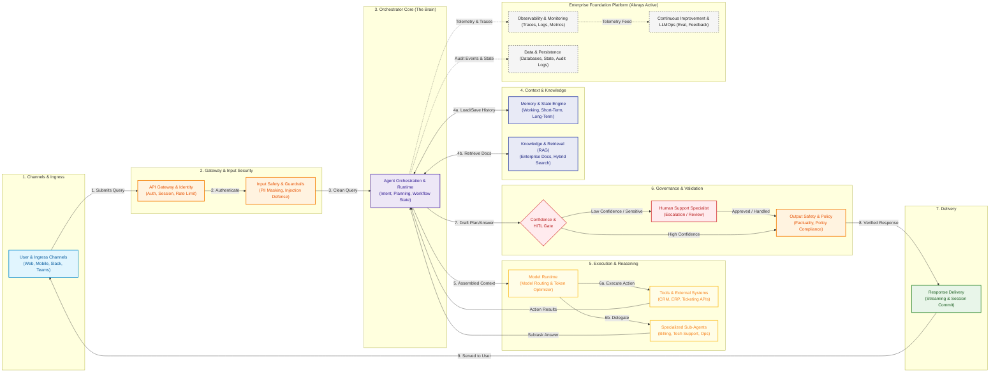

# Enterprise AI Support Agent: Abstract System Architecture & Data Flow

> **Version:** 1.0 (Abstract / High-Level Design)  
> **Source Capabilities:** [`thoughts.md`](./thoughts.md)  
> **Visual Canvas Diagram:** [`architecture.tldr`](./architecture.tldr)  
> **End-to-End Walkthrough Example:** [`request_response_lifecycle_example.md`](./request_response_lifecycle_example.md)  
> **Low-Level Design (LLD) Specification:** [`low_level_design.md`](./low_level_design.md)

---

## 1. Architectural Overview

This architecture models the end-to-end lifecycle of an **Enterprise AI Support Agent**, from the moment a user asks a query across any channel until the request is completely fulfilled, verified, and served.

The system is designed with a **modular pipeline pattern**, separating concerns into 7 logical flow stages and a continuous foundation platform:

```
[User Query] 
   ──> [Ingress & API Gateway] 
   ──> [Input Safety Shield] 
   ──> [Agent Orchestrator (Brain)] 
        ├──> [Memory & State Engine]
        ├──> [Knowledge & RAG Retrieval]
        └──> [Model Runtime & LLM]
             ├──> [Tools & External APIs]
             └──> [Specialized Domain Sub-Agents]
   ──> [Confidence & HITL Gate] 
   ──> [Output Safety & Policy Check] 
   ──> [Response Delivery] ──> [User]
```

---

## 2. End-to-End Data Flow Diagram



---

## 3. Step-by-Step Request Lifecycle

Here is the flow of data from start to finish:

### Step 1: Ingress & Channel Interaction
* **Components:** Web Widget, Mobile App, Slack / Teams bot, Email, or CRM Portal (`1. User & Application`).
* **Data Flow:** The user enters a question or issue description. The client sends an HTTP/WebSocket payload containing:
  * User Query
  * User Identity token (JWT/OAuth)
  * Session ID / Channel Metadata

### Step 2: Gateway, Authentication & Input Guardrails
* **Components:** API Gateway, Identity Provider, Input Safety Engine (`1. User & Application`, `7. Safety & Governance`, `11. Reliability`).
* **Action:**
  1. **Authentication & Rate Limiting:** Verifies tenant permissions and applies rate limits.
  2. **Security & Guardrail Check:** Inspects prompt for prompt injection, jailbreaks, malicious payloads, and masks sensitive PII (SSN, credit card, passwords).
* **Result:** A sanitized query payload is passed to the Agent Orchestrator.

### Step 3: Agent Orchestrator (The Runtime Brain)
* **Components:** Agent Harness, Intent Understanding, Planning & Decision Making, Workflow State (`2. Agent Orchestration & Runtime`).
* **Action:**
  1. Identifies the user's intent (e.g., informational query, account lookup, transaction execution, troubleshooting) with one **Jev** decision request (intent, urgency, missing details, each with a confidence). Low confidence leads to a clarifying question or a human.
  2. Initiates the workflow state machine and decision plan.
  3. Formulates queries for context enrichment.

### Step 4: Context Enrichment (Memory & RAG)
* **Components:** Memory & State, Knowledge & Retrieval (`3. Knowledge & Retrieval`, `4. Memory & State`, `8. Data & Persistence`).
* **Action:** The Orchestrator queries two parallel engines:
  1. **Memory & State:** Retrieves the current session history, user preferences, and previous ticket records.
  2. **Knowledge & Retrieval (RAG):** Performs hybrid vector + keyword search across enterprise knowledge bases, manuals, and FAQs, followed by reranking to select top-k relevant chunks.
* **Result:** The Orchestrator combines the user prompt, conversation history, and enterprise knowledge chunks into a focused context prompt.

### Step 5: Model Selection & Inference
* **Components:** Model Gateway, Cost & Resource Manager (`2. Model Interaction`, `12. Cost & Resource Management`).
* **Action:**
  * Dynamically selects the appropriate model tier (e.g., small fast model for standard FAQ lookup vs. large frontier reasoning model for complex workflows).
  * Executes prompt inference within allocated token budgets.

### Step 6: Tool Execution & Multi-Agent Delegation
* **Components:** Tools & Actions, Multi-Agent Communication (`5. Tools & Actions`, `6. Multi-Agent & Communication`).
* **Action:** If the model determines that an action or specialized investigation is required:
  * **Tool Invocation:** Calls external systems (Salesforce CRM, Jira/Zendesk, SAP/ERP, billing systems) through verified JSON schemas with schema validation and error handling.
  * **Multi-Agent Delegation:** If the problem requires specialized domain expertise (e.g. deep network troubleshooting or complex refund processing), delegates to a specialized sub-agent.
* **Result:** Structured results return to the Orchestrator to update the working state.

### Step 7: Confidence Evaluation & Human-in-the-Loop (HITL) Gate
* **Components:** Confidence Boundaries, Escalation & Handoff (`13. Human-in-the-Loop`).
* **Action:**
  * The system computes a confidence score for the generated answer/action.
  * **High Confidence / Non-sensitive:** Proceeds directly to output safety.
  * **Low Confidence / Sensitive Transaction:** Pauses autonomous execution and escalates to a human support specialist with full conversation and context history for review or complete handoff.

### Step 8: Output Safety & Response Delivery
* **Components:** Output Safety Guardrails, Response Streamer (`7. Safety & Governance`, `1. Request / Response`).
* **Action:**
  * Checks output against corporate policy, validates factuality (no hallucinations), and ensures appropriate tone.
  * Commits the updated conversation state and audit records to persistence.
  * Streams the final response to the user's original channel.

---

## 4. Continuous Enterprise Foundation Platforms

Running continuously in the background across all stages:

1. **Observability & Monitoring (Capability 10):**
   * Emits distributed OpenTelemetry traces across every hop (Gateway -> Safety -> Orchestrator -> LLM -> Tools).
   * Monitors latency, token usage, cost per conversation, and error rates.
2. **Data, State & Audit Persistence (Capability 8):**
   * Stores relational operational data, vector embeddings, and immutable compliance audit logs.
3. **Reliability & Performance (Capability 11):**
   * Manages retries, circuit breakers, fallback models, and horizontal scaling.
4. **Evaluation & Continuous Improvement (Capabilities 9, 14, 15, 16):**
   * Collects conversation traces and human feedback (thumbs up/down, agent edits).
   * Runs automated regression benchmarks and evaluations.
   * Feeds continuous updates to prompts, knowledge indices, and model fine-tuning pipelines.

---

## 5. Component Interaction & Connection Matrix

| Source Component | Destination Component | Protocol / Interface | Purpose & Data Payload |
| :--- | :--- | :--- | :--- |
| **User Channels** | **API Gateway** | HTTPS / WSS / REST | User query, channel metadata, auth token |
| **API Gateway** | **Input Safety** | Internal RPC / Middleware | Request payload for injection detection & PII masking |
| **Input Safety** | **Agent Orchestrator** | In-Memory / Message Bus | Sanitized query & verified tenant context |
| **Agent Orchestrator** | **Memory & State** | Redis / Key-Value Cache | Read/Write session history & working memory |
| **Agent Orchestrator** | **Knowledge & Retrieval** | Vector DB / Search API | Embedding query, receiving reranked doc passages |
| **Agent Orchestrator** | **Model Runtime** | LLM API (OpenAI / Anthropic / Local) | Context window prompt, receiving model completions & tool calls |
| **Model Runtime** | **Tools & Actions** | REST / gRPC / DB Connector | Function call arguments, receiving external system responses |
| **Model Runtime** | **Multi-Agent Swarm** | Agent-to-Agent Messaging | Subtask delegation, receiving domain agent findings |
| **Agent Orchestrator** | **Confidence & HITL Gate** | Policy Engine / Queue | Candidate plan/response, checking confidence threshold |
| **HITL Gate** | **Human Specialist** | Support Agent Dashboard | Escalated case, conversation summary, action approval prompt |
| **HITL Gate** | **Output Safety** | Middleware Guardrail | Candidate response for hallucination and policy scan |
| **Output Safety** | **Response Delivery** | Stream / WebSocket | Verified response text & citations delivered to User Channel |
| **All Components** | **Observability** | OTel / Prometheus / Datadog | Spans, execution metrics, cost and token telemetry |
| **All Components** | **Data & Persistence** | PostgreSQL / Vector DB / S3 | Operational logs, session state, immutable compliance records |

---

## 6. Mapping of 16 Capabilities from `thoughts.md`

| # | Capability Area (from `thoughts.md`) | Architectural Placement |
| :--- | :--- | :--- |
| **1** | **User & Application** | Ingress Tier: Channels/UI, API Gateway, Identity, Session |
| **2** | **Agent Orchestration & Runtime** | Central Brain: Harness, Understanding, Planning, Context Manager |
| **3** | **Knowledge & Retrieval** | Context Engine: Ingestion, Hybrid Vector Retrieval, Reranking |
| **4** | **Memory & State** | Context Engine: Short-term, Long-term, Working Memory |
| **5** | **Tools & Actions** | Execution Tier: Tool Registry, External Systems, Error Handling |
| **6** | **Multi-Agent & Communication** | Execution Tier: Domain Specialized Sub-Agents & Coordination |
| **7** | **Safety, Security & Governance** | Ingress & Egress: Input Shield (PII/Injection) & Output Factuality |
| **8** | **Data & Persistence** | Foundation Tier: SQL DB, Vector Store, Audit Event Trail |
| **9** | **Evaluation & Experimentation** | Foundation Tier: Offline benchmarks, retrieval & agent evaluation |
| **10** | **Observability & Monitoring** | Foundation Tier: Traces, logs, token/cost monitoring |
| **11** | **Reliability / Performance / Scale** | Gateway & Runtime: Retries, circuit breakers, rate limits |
| **12** | **Cost & Resource Management** | Execution Tier: Dynamic model routing & token budgeting |
| **13** | **Human-in-the-Loop** | Governance Tier: Confidence boundaries, escalation & handoff |
| **14** | **Testing & Quality** | LLMOps Platform: Unit, E2E, agent behavior & regression test suites |
| **15** | **Deployment & LLMOps** | LLMOps Platform: Environments, CI/CD, versioning, rollback |
| **16** | **Continuous Improvement** | LLMOps Platform: Production feedback loops & failure analysis |

---

## 7. How to View and Edit the Diagram

The interactive diagram in [`architecture.tldr`](./architecture.tldr) contains two comprehensive sections on the same canvas:
1. **Section 1 (Tiers 1–4):** Complete System Architecture & Request-Response Lifecycle Flow.
2. **Section 2 (Below Tier 4):** Component & Trajectory Failure Modes (2x2 Knowns & Unknowns Matrix).

* **Inside VS Code:** Open [`architecture.tldr`](./architecture.tldr) directly if you have the [tldraw VS Code Extension](https://marketplace.visualstudio.com/items?itemName=tldraw-org.tldraw-vscode) installed.
* **In the Browser:** Go to [tldraw.com](https://www.tldraw.com), click the menu (`☰`), select **File** -> **Open**, and choose `architecture.tldr` from this project directory.
* **To Re-generate or Modify:** You can adjust the layout or node properties in [`generate_architecture_tldr.py`](./generate_architecture_tldr.py) and re-run:
  ```bash
  python generate_architecture_tldr.py
  ```
